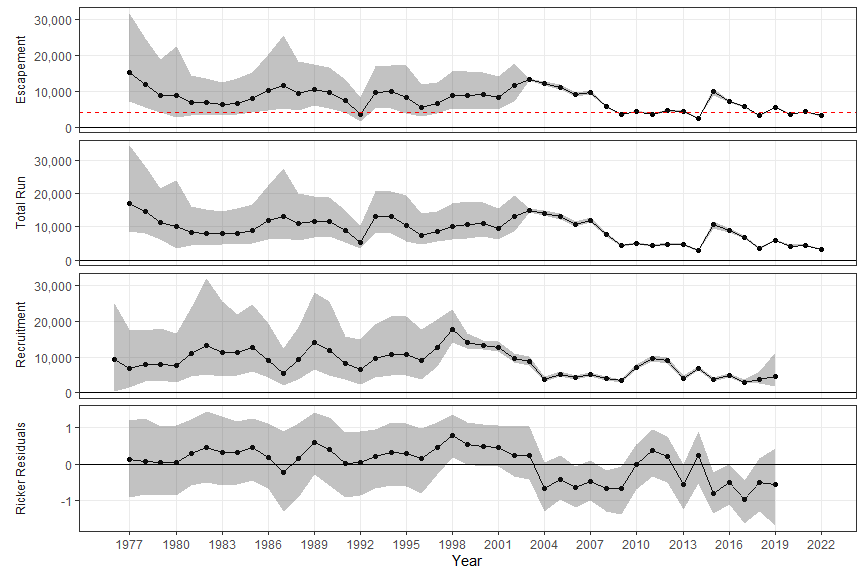
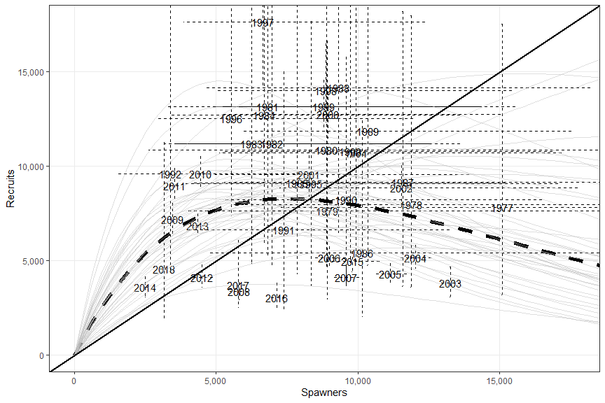
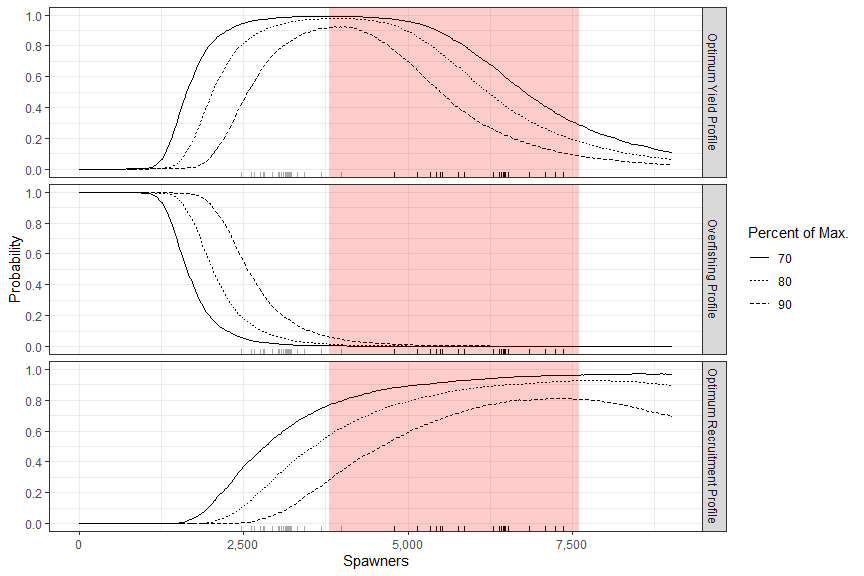

Logan and I updated the Anchor River escapement goal analysis using data through the 2022 season. Two models were considered. One model is an update of the analysis used to update the goal after the 2016 season while the second model was an update of the analysis used to to create FDS07-05. The 2016 analysis truncated the SR data set to include only those years where we had the highest quality data while the analysis from FDS07-05 used all of the available data. Herein we present the results for the model using all available data although the results from the two models were similar. 
  
The precision associated with estimates of escapement improve markedly after the sonar/weir was installed although this period also coincides with mostly negative Ricker residuals. This patterns of our best assessments failing to capture high productivity regimes occurs in most of our Chinook SR data sets and is the reason I prefer to use all available data wherever possible.  
  

Figure 1. - Estimates of  return, total tun, escapement, and Ricker residuals for Anchor River chinook salmon, 1977-2022

  
We have SR information at a wide range of escapements.
  

Figure 2. - Ricker curve for Anchor River chinook salmon, 1977-2022

  
The existing goals are among the most conservative Chinook salmon goals in the state. Given the current parameters estimates that goal is set around the same criteria used in the 2010 escapement goal review (lower bound at $S_{msy}$ and upper bound at $S_{max}$) although it is more conservative than the 2016 goal revision.
  

Figure 3. - Optimal Yield Probability profile for Anchor River chinook salmon, 1977-2022

  
  
Table 1.- Parameter estimates for Anchor River chinook salmon SR analysis, 1977-2022

|         Parameter|                Median (95% CI)|
|-----------------:|------------------------------:|
|         $S_{MSY}$|          3,933 (2,772 - 6,710)|
|          $S_{EQ}$|         9,684 (6,602 - 17,720)|
|         $S_{MSR}$|         7,552 (4,496 - 22,605)|
|      ln($\alpha$)|               1.1 (0.27 - 2.0)|
|           $\beta$| 1.32e-04 (4.42e-05 - 2.22e-04)|
|          $\alpha$|                3.0 (1.3 - 7.5)|
|            $\phi$|             0.57 (0.13 - 0.92)|
|      $\sigma_{w}$|             0.45 (0.33 - 0.66)|
|         $U_{MSY}$|             0.52 (0.22 - 0.80)|
|         $\pi_{1}$|             0.09 (0.07 - 0.12)|
|         $\pi_{2}$|             0.32 (0.28 - 0.36)|
|         $\pi_{3}$|             0.50 (0.45 - 0.54)|
|         $\pi_{4}$|             0.09 (0.07 - 0.12)|
|                 D|             25.6 (16.5 - 38.3)|
| $q_{survey77-88}$|             0.18 (0.10 - 0.32)|
| $q_{survey89-07}$|             0.07 (0.05 - 0.09)|
